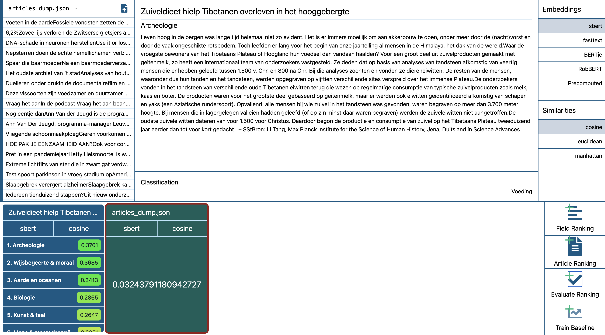

# Word Embeddings

Welcome to the word embeddings project, where all the code for the word embedding task can be found. It is organised into two folders: `word-embeddings` contains the python code to generate word embeddings, train the SVM baseline and the back-end of the demo tool, of which the fronte-nd is entirely in the `word-embeddings-explorer` directory. In both directories, another README can be found that explains how to run both front- and back-end.

